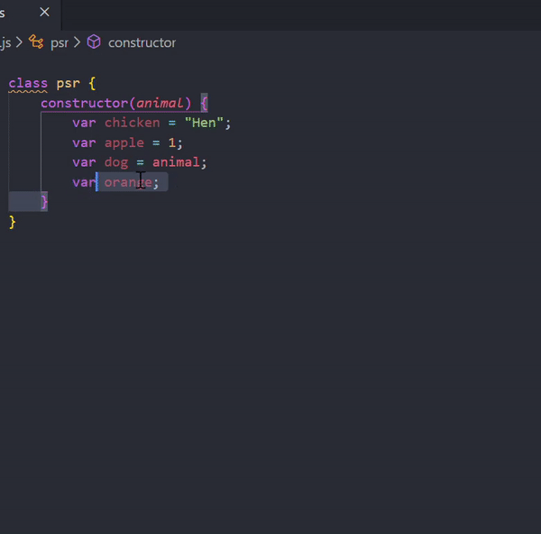

# Auto Setter&Getter for JS README

A simple way to create setter and getter for Javascript class.

## Features

> Tip: It works best when your select ends with '}'.

-----------------------------------------------------------------------------------------------------------

### For more information

* [Github Repo](https://github.com/nivleM-ed/autosettergetterjs)

-----------------------------------------------

Hey! If you happen to use this and have some complaint or anything that I can improve on this extension do contact me (Details in Github). I'm still a student and hope to use this as a learning opportunity since I couldn't find any extension like this. Cheers!