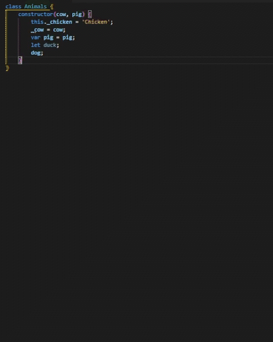

# Auto Setter&Getter for JS README

A simple way to create setter and getter for Javascript class.

## Features

> Highlight your variables within a bracket and run the command (F1 + JS Setter Getter)

-----------------------------------------------------------------------------------------------------------
### Latest Updates:
- Generate setters and getters for different use cases
- Prevent duplicated generation of setters and getters
-----------------------------------------------------------------------------------------------------------
### For more information:

* [Github Repo](https://github.com/nivleM-ed/autosettergetterjs)

-----------------------------------------------

Hey! If you happen to use this and have some complaint or anything that I can improve on this extension do contact me (Details in Github). Created this extension since I couldn't find any extension like this. Cheers!

